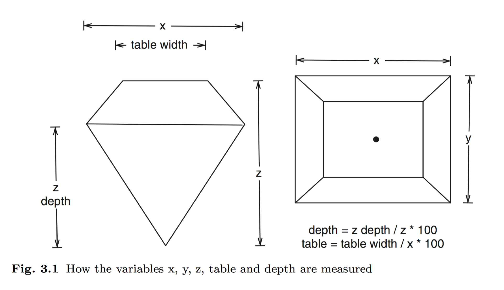

```{r setup, include=FALSE}
knitr::opts_chunk$set(echo = FALSE)
library(tidyverse)
theme_set(theme_minimal())
d1 <- diamonds
```


In this homework, you will use `diamonds` data set from `ggplot2` package. It is automatically loaded when you execute `library(ggplot2)` so you don't have to separately load it. Please create a duplicate of `diamonds` and use that for homework. This will avoid corrupting the original data set.

Make sure that you understand the variables in the data by checking the help file by executing `help(diamonds)` in the console. The data has five variables that measure the dimensions. The diagram below explains these dimensions.


```{r echo=FALSE, out.width="75%"}

```

## Instructions

1. You are expected to recreate each plot **exactly** as shown in this homework.
2. The objective of this homework is to help you develop fine grain control over `ggplot2`. As such, please refrain from exercising artistic freedom!
3. All the plots use `theme_minimal()`. You can set this as your default theme by adding this line in the `setup` chunk **after** you load `ggplot2` library:
`theme_set(theme_minimal())`


## Q1

Recreate the following graph. The parameter that controls transparency is set at 0.3. You need not get exactly the same colors but they must be **discrete** and should not follow a color gradient.

<aside>

**Hint**: The points are hollow circles. Recall that we covered this specific `shape` in the last class.

</aside>

<aside>

**Hint**: Note that the Y axis text is modified.

</aside>

```{r Q1}
ggplot(d1, aes(carat, price)) +
  geom_point(aes(fill = as.character(clarity)), shape = 21 ,alpha = 0.3) +
  scale_y_continuous(labels = scales::dollar_format()) +
  labs(x = "Diamond Carats", 
       y = "Diamond Price",
       title = "Scatterplot of Diamond Prices")
```


## Q2

The previous graph looks cluttered. So you decided to use facets instead. Recreate the following graph:


```{r Q2, fig.width=10, fig.fullwidth = TRUE}
ggplot(d1, aes(carat, price)) +
  geom_point(aes(fill = as.character(clarity)),
             shape = 21,
             alpha = 0.3) +
  scale_y_continuous(labels = scales::dollar_format()) +
  facet_wrap(~clarity, nrow = 2) +
  labs(x = "Diamond Carats", 
       y = "Diamond Price",
       title = "Scatterplot of Diamond Prices") +
  theme(legend.position = "none")

```

## Q3

Next, you want to know whether the price of diamonds depends on table and depth. Note the line types. Recreate the following graphs:

<aside>

**Hint**: Pay attention to the X axis limits. Also, read up more on `linetype` [here](https://cran.r-project.org/web/packages/ggplot2/vignettes/ggplot2-specs.html). Both Q3 plots use [`geom_smooth`](https://ggplot2.tidyverse.org/reference/geom_smooth.html). 

</aside>


```{r Q3.1, message=FALSE}
ggplot(d1, aes(table, price)) +
  geom_smooth(method = "lm", 
              color = "red", 
              linetype = "dashed") +
  scale_x_continuous(limits = c(0, 100)) +
  xlab("Table") + ylab("Price") 


```


<aside>

**Hint**: Pay attention to the X axis limits and breaks. 

</aside>

```{r Q3.2, message=FALSE}
ggplot(d1, aes(depth, price)) +
  geom_smooth(method = "lm", 
              color = "white", 
              linetype = "dotdash") +
  scale_x_continuous(limits = c(0, 80), breaks = seq(0, 80, 10)) +
  xlab("Depth") + ylab("Price") 

```


## Q4

Recreate each of the following graphs for data exploration:


<aside>
**Hint**: In this plot, change the colors manually. Use any colors you want but I have used a color palette with these colors: 99B898, FECEAB, FF847C, E84A5F, 2A363B. If you decide to use them, don't forget to add a `#` prefix to each color code. 

</aside>


```{r Q4.1, message=FALSE}

ggplot(d1, aes(x = x*y*z, price)) +
  geom_point(aes(color = cut)) +
  scale_color_manual(values = c("#99B898", "#FECEAB", "#FF847C", "#E84A5F", "#2A363B")) 
```


<aside>

**Hint**: Pay attention to the axes text formatting

</aside>

```{r Q4.2}

ggplot(d1, aes(price)) + 
  geom_histogram(bins = 75, color = "white") +
  scale_x_continuous(labels = scales::dollar_format()) +
  scale_y_continuous(labels = scales::comma_format())
```


<aside>

**Hint**: Note that the bars have a distinct border. You can use any color you want. Note also that the legend is not visible.

</aside>


```{r Q4.3}
ggplot(d1, aes(clarity)) + 
  geom_bar(aes(fill = clarity), color = "#c61c5a") + 
  theme(legend.position = "none")

```


<aside>
**Hint**: Here you have to use two new `geoms` for the [violin plot](https://ggplot2.tidyverse.org/reference/geom_violin.html) and the [jittered points](https://ggplot2.tidyverse.org/reference/geom_jitter.html). 

</aside>

```{r Q4.4}
ggplot(d1, aes(cut, depth)) + 
  geom_violin(color = "blue") + 
  geom_jitter(alpha = 0.05, 
              color = "red")
```


<aside>

**Hint**: This plot uses two layers of [`geom_smooth`](https://ggplot2.tidyverse.org/reference/geom_smooth.html). 

</aside>

```{r Q4.5, message=FALSE}
ggplot(d1, aes(x, price)) +
  geom_smooth(se = FALSE) +
  geom_smooth(method = "lm", 
              color = "green", 
              se = FALSE)

```


